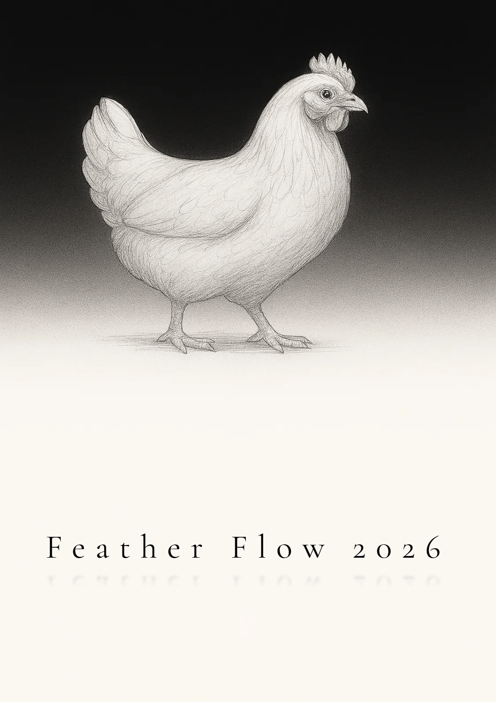

Feather Flow
============

|ff2026_pdf|

.. |ff2026_pdf| image:: https://img.shields.io/badge/Feather_Flow_2026-PDF-blue?logo=adobeacrobatreader&logoColor=white
   :target: https://github.com/stamerlan/feather-flow/releases/download/latest/ff-2026.pdf
   :alt: Feather Flow 2026

Feather Flow is a digital planner PDF generator built on top of
`Jinja2 <https://jinja.palletsprojects.com/>`_ templates and
`Playwright <https://playwright.dev/python/>`_. Design your planner pages in
HTML/CSS, feed them to **pyplaner**, and get a print-ready PDF.

|cover| |year| |month| |day|

.. |year| image:: docs/images/year-calendar-page.png
   :width: 24%
.. |month| image:: docs/images/month-calendar-page.png
   :width: 24%
.. |day| image:: docs/images/day-page.png
   :width: 24%

Prerequisites
-------------

* `Python <https://www.python.org/>`_ **3.12** or newer
* `pip <https://pip.pypa.io/>`_ (Python package installer)
* `Git <https://git-scm.com/>`_ (to clone the repository)

Python installations from `python.org <https://www.python.org/downloads/>`_ and
the Windows Store include pip out of the box. On Linux it is often shipped in a
separate package. Install it with your distribution's package manager if the
``pip`` command is not available:

**Debian / Ubuntu**::

    sudo apt install python3-pip python3-venv

**Fedora**::

    sudo dnf install python3-pip

**Arch Linux**::

    sudo pacman -S python-pip

**macOS** (Homebrew)::

    brew install python

Getting Started
---------------

Clone the repository::

    git clone https://github.com/stamerlan/feather-flow.git
    cd feather-flow

It is recommended to install Feather Flow inside a
`virtual environment <https://docs.python.org/3/tutorial/venv.html>`_ - a
self-contained directory that keeps the project's dependencies isolated from the
system Python and from other projects. This avoids version conflicts and lets
you remove everything cleanly by simply deleting the ``.venv`` folder.

Create and activate a virtual environment, then install the package.

On **Linux / macOS**::

    python -m venv .venv
    source .venv/bin/activate
    pip install .

On **Windows**::

    python -m venv .venv
    .venv\Scripts\activate
    pip install .

Playwright requires a browser binary. Install it once after the package is
installed::

    playwright install chromium

To enable PDF optimization, install the optional ``pikepdf`` extra::

    pip install .[pikepdf]

Usage
-----

Generate a PDF from a template::

    pyplaner pages/ff-2026.html

Generate both HTML and PDF::

    pyplaner --html --pdf pages/ff-2026.html

Suppress progress output::

    pyplaner -q pages/ff-2026.html

Run ``pyplaner --help`` for the full list of options.

Building the Documentation
--------------------------

The project uses `Sphinx <https://www.sphinx-doc.org/>`_ with the
`Read the Docs <https://sphinx-rtd-theme.readthedocs.io/>`_ theme.

Install the documentation dependencies::

    pip install .[docs]

Build the HTML docs.

On **Linux / macOS**::

    make -C docs html

On **Windows**::

    cd docs
    make.bat html

The generated site is written to ``docs/_build/html/``. Open
``docs/_build/html/index.html`` in a browser to view it locally.

On every push to **main**, the
`Sphinx Documentation <https://github.com/stamerlan/feather-flow/actions/workflows/build-sphinx-docs.yml>`_
workflow builds and deploys the docs to GitHub Pages automatically.
