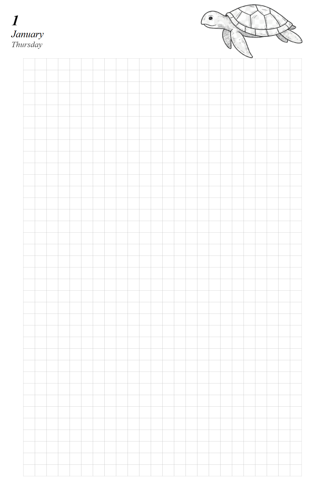

Designer Guide
==============

This guide teaches you how to create and customize planner templates for Feather
Flow. You will learn the project layout, the Jinja2 template language, the
calendar data available in every template, how to manage images, fonts and
stylesheets, and how to preview your work in a browser while you design.

No programming experience is required. If you are comfortable writing HTML and
CSS you already have all the skills you need. You will also need Python 3.12 or
newer, a text editor (we recommend `VS Code <https://code.visualstudio.com/>`_),
and the Feather Flow repository cloned and set up. Follow the *Getting Started*
section in the project :doc:`README </index>` to install the virtual environment
and Playwright.

Throughout the guide we build a small **Mini Planner** step by step - a
simplified planner for a single month with a cover page, a month calendar and
individual day pages. By the end you will have a working template you can extend
into a full design.

|year-title| |month-cal| |day-page|

.. |year-title| image:: ../images/mini-planner-year-title.png
   :width: 25%
.. |month-cal| image:: ../images/mini-planner-month-cal.png
   :width: 25%

Start with :doc:`project-structure` to learn where files live and how the
rendering pipeline works.

.. toctree::
   :maxdepth: 1

   project-structure
   template-basics
   jinja2-variables
   jinja2-loops-conditionals
   jinja2-macros
   data-reference
   assets-and-styling
   live-preview
