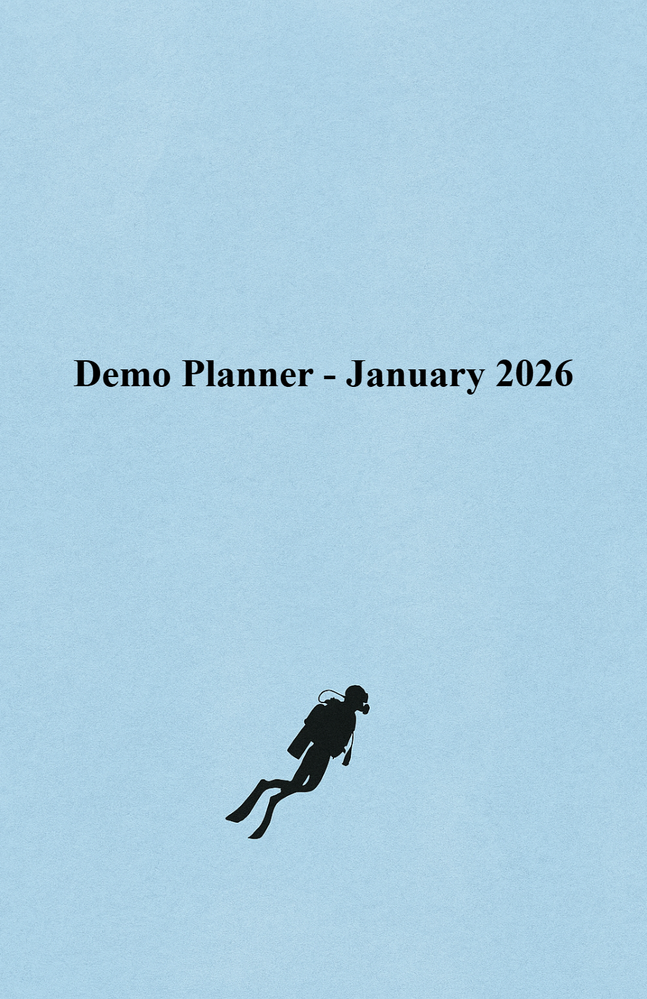
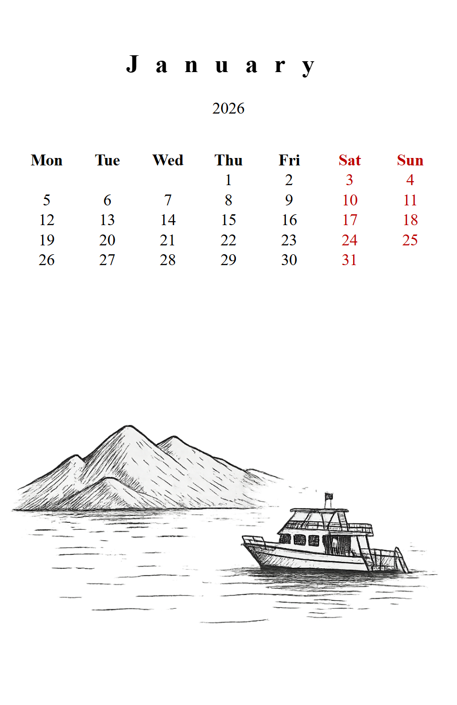
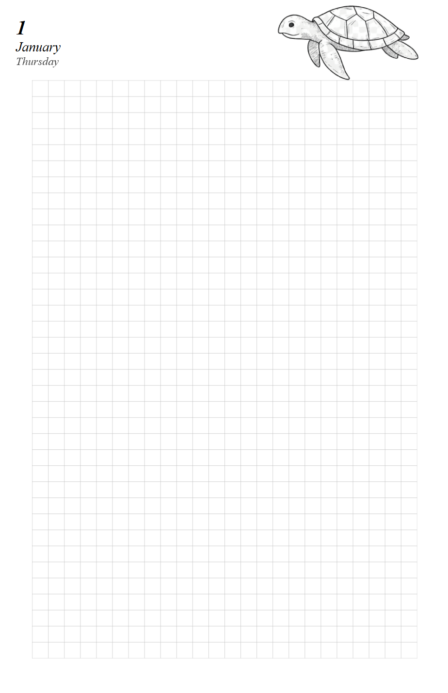

Designer Guide
==============

This guide teaches you how to create and customize planner templates for Feather
Flow. You will learn the project layout, the Jinja2 template language, the
calendar data available in every template, how to manage images, fonts and
stylesheets, and how to preview your work in a browser while you design.

No programming experience is required. If you are comfortable writing HTML and
CSS you already have all the skills you need. You will also need Python 3.12 or
newer, a text editor you are comfortable with, and the Feather Flow repository
cloned and set up. Follow the *Getting Started* section in the project
:doc:`README </index>` to install the virtual environment and Playwright.

Throughout the guide we build a small **Demo Planner** step by step - a
simplified planner for a single month with a cover page, a month calendar and
individual day pages. By the end you will have a working template you can extend
into a full design.

|year-title| |month-cal| |day-page|

The finished Demo Planner lives in ``planners/demo/``. To see the final result
before you start, generate it with::

    pyplanner planners/demo

If you would like to follow the guide hands-on, delete everything in
``planners/demo/`` except the ``assets/`` folder and build the template from
scratch. You can always restore the original files with git::

    git checkout -- planners/demo/

Start with :doc:`project-structure` to learn where files live and how the
rendering pipeline works.

.. toctree::
   :maxdepth: 1

   project-structure
   template-basics
   jinja2-variables
   jinja2-loops-conditionals
   jinja2-macros
   data-reference
   template-parameters
   assets-and-styling
   live-preview
