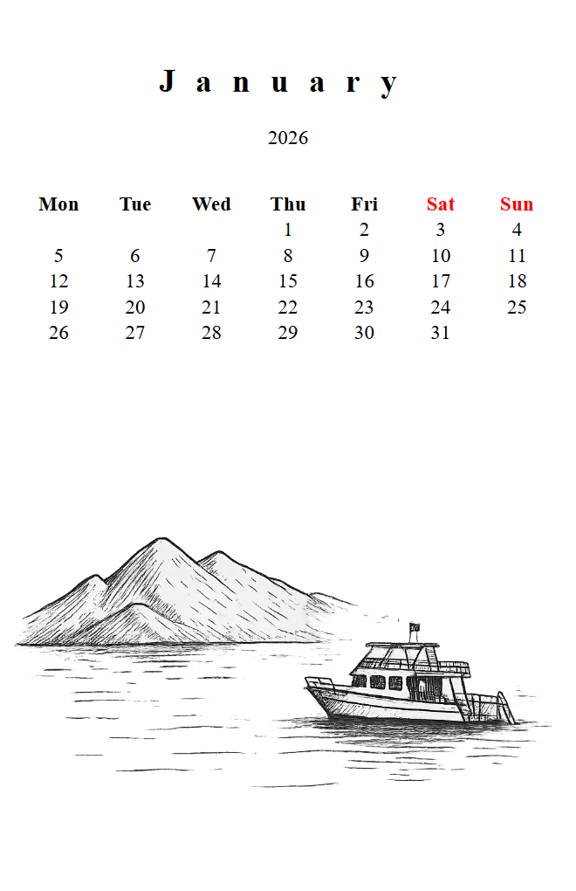

Loops and Conditionals
======================

Planners are repetitive by nature - twelve month pages, up to 31 day pages per
month, seven weekday headers in every table. Loops let you generate all that
HTML from a single block of code. Conditionals let you change what appears based
on the data - for example highlighting weekends in red.

**Key topics**

* ``for`` loops and how to iterate over months, days, weeks.
* The ``loop`` helper variable (index, first, last).
* ``if`` / ``elif`` / ``else`` conditionals.
* The ``is none`` test for empty calendar cells.

For loops
---------

A ``for`` loop repeats a block of HTML once for every item in a list.

**Template:**

.. code-block:: html+jinja

   <ul>
     %% for month in year.months
     <li>{{ month }}</li>
     %% endfor
   </ul>

**Output:**

.. code-block:: html

   <ul>
     <li>January</li>
     <li>February</li>
     <li>March</li>
     <li>April</li>
     <li>May</li>
     <li>June</li>
     <li>July</li>
     <li>August</li>
     <li>September</li>
     <li>October</li>
     <li>November</li>
     <li>December</li>
   </ul>

``year.months`` is a list of twelve Month objects. On each pass through the loop
the variable ``month`` holds the current item. The name before ``in`` is up to
you - ``month``, ``m`` or anything else.

Nested loops
~~~~~~~~~~~~

Loops can be placed inside other loops. The planner template uses this to build
calendar tables - an outer loop over weeks and an inner loop over days in each
week.

**Template:**

.. code-block:: html+jinja

   %% for month in year.months
   <h2>{{ month }}</h2>
   <table>
     %% for week in month.table
     <tr>
       %% for day in week
       <td>{{ day }}</td>
       %% endfor
     </tr>
     %% endfor
   </table>
   %% endfor

**Output** (January 2026 excerpt, first two weeks):

.. code-block:: html

   <h2>January</h2>
   <table>
     <tr>
       <td></td>
       <td></td>
       <td></td>
       <td>1</td>
       <td>2</td>
       <td>3</td>
       <td>4</td>
     </tr>
     <tr>
       <td>5</td>
       <td>6</td>
       <td>7</td>
       <td>8</td>
       <td>9</td>
       <td>10</td>
       <td>11</td>
     </tr>
     ...
   </table>

Some cells are empty because January 2026 starts on a Thursday. We will handle
those empty cells with a conditional below.

The ``loop`` variable
---------------------

Inside every ``for`` block Jinja2 provides a special variable called ``loop``
with useful information about the current iteration.

.. list-table::
   :header-rows: 1
   :widths: 30 45

   * - Property
     - Description
   * - ``loop.index``
     - Current iteration, starting at 1.
   * - ``loop.index0``
     - Current iteration, starting at 0.
   * - ``loop.first``
     - ``true`` on the first iteration.
   * - ``loop.last``
     - ``true`` on the last iteration.
   * - ``loop.length``
     - Total number of items.

**Template:**

.. code-block:: html+jinja

   <ul>
     %% for month in year.months
     <li>{{ loop.index }}. {{ month }}</li>
     %% endfor
   </ul>

**Output:**

.. code-block:: html

   <ul>
     <li>1. January</li>
     <li>2. February</li>
     <li>3. March</li>
     ...
     <li>12. December</li>
   </ul>

Using ``loop.index0`` for tuple access
~~~~~~~~~~~~~~~~~~~~~~~~~~~~~~~~~~~~~~~

When a planner has twelve month pages, each with its own background image, the
images can be stored in a tuple and accessed by position using ``loop.index0``:

**Template:**

.. code-block:: html+jinja

   %% set month_backgrounds = (
     "assets/month-jan.png",
     "assets/month-feb.png",
     "assets/month-mar.png",
   )

   %% for month in year.months
   

     
     <h2>{{ month }}</h2>
   

   %% endfor

On the first iteration ``loop.index0`` is 0, so it picks
``assets/month-jan.png``. On the second it is 1, and so on.

.. tip::

   Use ``loop.index0`` (zero-based) when indexing into a list or tuple. Use
   ``loop.index`` (one-based) when displaying a number to the reader.

If / elif / else
----------------

Conditionals let you show or hide HTML based on a condition.

**Template:**

.. code-block:: html+jinja

   %% for day in calendar.weekdays
   %% if day.is_off_day
   <th style="color: red;">{{ day.name[:3] }}</th>
   %% else
   <th>{{ day.name[:3] }}</th>
   %% endif
   %% endfor

**Output:**

.. code-block:: html

   <th>Mon</th>
   <th>Tue</th>
   <th>Wed</th>
   <th>Thu</th>
   <th>Fri</th>
   <th style="color: red;">Sat</th>
   <th style="color: red;">Sun</th>

Saturday and Sunday have ``is_off_day`` set to ``true``, so they get the red
style.

Inline conditionals
~~~~~~~~~~~~~~~~~~~

For short checks you can write the condition on one line:

.. code-block:: html+jinja

   <th{{ ' style="color: red;"'
         if day.is_off_day else '' }}>
     {{ day.name[:3] }}
   </th>

This produces the same result as the block form above but is more compact.

The ``is none`` test
--------------------

``month.table`` is a grid of weeks and days. Some cells are empty - for example
January 2026 starts on Thursday, so Monday through Wednesday of the first week
have no day. These cells contain ``None``.

Use ``is none`` (or ``is not none``) to check:

**Template:**

.. code-block:: html+jinja

   %% for week in month.table
   <tr>
     %% for day in week
     %% if day is not none
     <td>{{ day }}</td>
     %% else
     <td></td>
     %% endif
     %% endfor
   </tr>
   %% endfor

**Output** (January 2026, first week):

.. code-block:: html

   <tr>
     <td></td>
     <td></td>
     <td></td>
     <td>1</td>
     <td>2</td>
     <td>3</td>
     <td>4</td>
   </tr>

.. warning::

   Always use ``is none`` or ``is not none`` instead of ``== None`` or
   ``!= None``. The ``is`` form is the correct Jinja2 way.

**Do:**

.. code-block:: html+jinja

   %% if day is not none

**Don't:**

.. code-block:: html+jinja

   %% if day != None

Do and don't summary
--------------------

.. list-table::
   :header-rows: 1
   :widths: 50 50

   * - Do
     - Don't
   * - ``%% if day is not none``
     - ``%% if day != None``
   * - ``loop.index0`` for tuple/list access.
     - ``loop.index`` when you need zero-based indexing.
   * - Close every ``for`` with ``endfor``.
     - Forget ``%% endfor`` - the template will fail to render.
   * - Close every ``if`` with ``endif``.
     - Forget ``%% endif``.

Update the Mini Planner
-----------------------

Add a second page that shows a calendar table for the month. Open
``pages/mini-planner.html`` and add the following after the cover
page div (before ``</body>``):

.. code-block:: html+jinja

   

     
     <h2 style="text-align: center; margin-top: 15mm;
                font-size: 22pt; letter-spacing: 5mm;">
       {{ month }}
     </h2>
     

       {{ year }}
     

     <table style="width: calc(100% - 10mm);
                   margin: 10mm 5mm 0 5mm;
                   border-collapse: collapse;
                   font-size: 14pt; text-align: center;
                   table-layout: fixed;">
       <thead>
         <tr>
           %% for wd in calendar.weekdays
           %% if wd.is_off_day
           <th style="color: red;">{{ wd.name[:3] }}</th>
           %% else
           <th>{{ wd.name[:3] }}</th>
           %% endif
           %% endfor
         </tr>
       </thead>
       <tbody>
         %% for week in month.table
         <tr>
           %% for day in week
           %% if day is not none
           <td>{{ day }}</td>
           %% else
           <td></td>
           %% endif
           %% endfor
         </tr>
         %% endfor
       </tbody>
     </table>
   

This uses three nested concepts you learned on this page:

* A loop over ``calendar.weekdays`` for the header row.
* A conditional to color weekends red.
* Nested loops over ``month.table`` (weeks, then days) with an ``is not none``
  check for empty cells.

Regenerate::

    pyplaner --html pages/mini-planner.html

You should now see two pages - the cover and a month calendar.

What is next
------------

The calendar table has quite a lot of repeated HTML. Continue to
:doc:`jinja2-macros` to extract it into a reusable macro.
