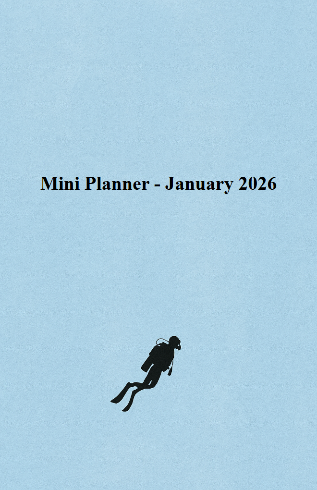

Variables, Expressions and Comments
====================================

Templates become powerful when you mix HTML with dynamic data. Jinja2 is the
template engine Feather Flow uses. This page covers the basics - outputting
values, creating your own variables, using filters and leaving comments.

**Key topics**

* Two syntax styles - block tags and line statements.
* Outputting values with ``{{ }}``.
* Creating variables with ``set``.
* Accessing properties with dot notation.
* Filters for transforming values.
* Comments.

Two syntax styles
-----------------

Jinja2 has a standard block syntax that uses curly braces. In addition, Feather
Flow enables a shorthand called *line statements* that starts with ``%%``. Both
are equivalent - use whichever you find more readable.

.. list-table::
   :header-rows: 1
   :widths: 25 35 35

   * - Purpose
     - Block syntax
     - Line statement
   * - Output a value
     - ``{{ year }}``
     - (same)
   * - Statement
     - ````
     - ``%% set x = 1``
   * - Comment
     - ``{# a comment #}``
     - ``## a comment``

The rest of this guide uses line statements (``%%``) because they look cleaner
in HTML templates. Remember you can always switch to the block form if you
prefer.

Outputting values
-----------------

Double curly braces print a value into the HTML:

**Template:**

.. code-block:: html+jinja

   
Hello, {{ "world" }}!

**Output:**

.. code-block:: html

   
Hello, world!

You can output any expression - a string, a number or a variable. Jinja2
converts it to text automatically.

Setting variables
-----------------

Use ``set`` to create a variable that you can reuse later.

**Template:**

.. code-block:: html+jinja

   %% set year = calendar.year(2026)
   <h1>Planner {{ year }}</h1>

**Output:**

.. code-block:: html

   <h1>Planner 2026</h1>

The ``calendar`` object is provided by pyplaner (see :doc:`data-reference` for
the full list). Calling ``calendar.year(2026)`` creates a ``Year`` object that
knows everything about that year - its months, days, whether it is a leap year
and more.

.. tip::

   Always call ``calendar.year()`` once at the top of your template and store
   the result in a variable. Do not call it multiple times - it does the same
   work each time.

**Do:**

.. code-block:: html+jinja

   %% set year = calendar.year(2026)
   <h1>{{ year }}</h1>
   
{{ year }} has {{ year.months|length }} months

**Don't:**

.. code-block:: html+jinja

   <h1>{{ calendar.year(2026) }}</h1>
   
{{ calendar.year(2026) }} again

Dot notation
------------

Objects have properties you access with a dot:

**Template:**

.. code-block:: html+jinja

   %% set year = calendar.year(2026)
   %% set january = year.months[0]
   
First month: {{ january.name }}

   
Month ID: {{ january.id }}

   
Days in January: {{ january.days|length }}

**Output:**

.. code-block:: html

   
First month: January

   
Month ID: 2026-01

   
Days in January: 31

Use square brackets to access items by position. Positions start at zero, so
``year.months[0]`` is January and ``year.months[11]`` is December.

String slicing
--------------

You can slice strings the same way you slice lists. This is handy for
abbreviations.

**Template:**

.. code-block:: html+jinja

   %% set year = calendar.year(2026)
   %% set january = year.months[0]
   <th>{{ january.name[:3] }}</th>

**Output:**

.. code-block:: html

   <th>Jan</th>

``[:3]`` means "the first three characters". This is handy for showing short
month and weekday names in calendar tables.

String representation
---------------------

Many objects print a human-friendly value when you put them directly inside
``{{ }}``:

.. list-table::
   :header-rows: 1
   :widths: 35 30

   * - Expression
     - Output
   * - ``{{ year }}``
     - ``2026``
   * - ``{{ month }}``
     - ``January``
   * - ``{{ day }}``
     - ``15`` (the day number)
   * - ``{{ day.weekday }}``
     - ``Wednesday``

So ``{{ day }}`` is a shortcut for ``{{ day.value }}``. Both produce the same
text, but the shorter form is preferred.

**Do:**

.. code-block:: html+jinja

   <td>{{ day }}</td>

**Don't** (unnecessary - same result, more typing):

.. code-block:: html+jinja

   <td>{{ day.value }}</td>

Filters
-------

Filters transform a value. You apply them with the pipe character ``|``.

.. list-table::
   :header-rows: 1
   :widths: 40 30

   * - Expression
     - Output
   * - ``{{ "hello"|upper }}``
     - ``HELLO``
   * - ``{{ "HELLO"|lower }}``
     - ``hello``
   * - ``{{ year.months|length }}``
     - ``12``
   * - ``{{ 3.14159|round(2) }}``
     - ``3.14``

**Template:**

.. code-block:: html+jinja

   %% set year = calendar.year(2026)
   
{{ year.months|length }} months

**Output:**

.. code-block:: html

   
12 months

You will rarely need filters beyond ``length`` in planner templates, but they
are there if you want them.

Comments
--------

Comments are ignored by the engine and do not appear in the output.

**Line comment** (recommended in Feather Flow templates):

.. code-block:: html+jinja

   ## This line will not appear in the output.
   
This line will.

**Block comment:**

.. code-block:: html+jinja

   {# This will not appear in the output either. #}
   
This line will.

**HTML comment** (still appears in the output):

.. code-block:: html

   <!-- This IS visible in the generated HTML. -->

Use ``##`` or ``{# #}`` for notes to yourself. Use ``<!-- -->`` only if you want
the comment to survive into the final HTML.

Update the Mini Planner
-----------------------

Open ``pages/mini-planner.html`` and add variables for the year and the month.
Our Mini Planner covers a single month, so we pick January (``year.months[0]``).
The cover shows both the month name and the year dynamically:

.. code-block:: html+jinja

   %% set year = calendar.year(2026)
   %% set month = year.months[0]
   <!doctype html>
   <html>
   <head>
     {{ planner_head }}
     <meta charset="utf-8">
     
   </head>
   <body>
     

       
       <h1 style="text-align: center; padding-top: 70mm;">
         Mini Planner - {{ month }} {{ year }}
       </h1>
     

   </body>
   </html>

Regenerate and check::

    pyplaner --html pages/mini-planner.html

The title should now read "Mini Planner - January 2026".

What is next
------------

Continue to :doc:`jinja2-loops-conditionals` to learn how to repeat HTML with
loops and show content conditionally.
