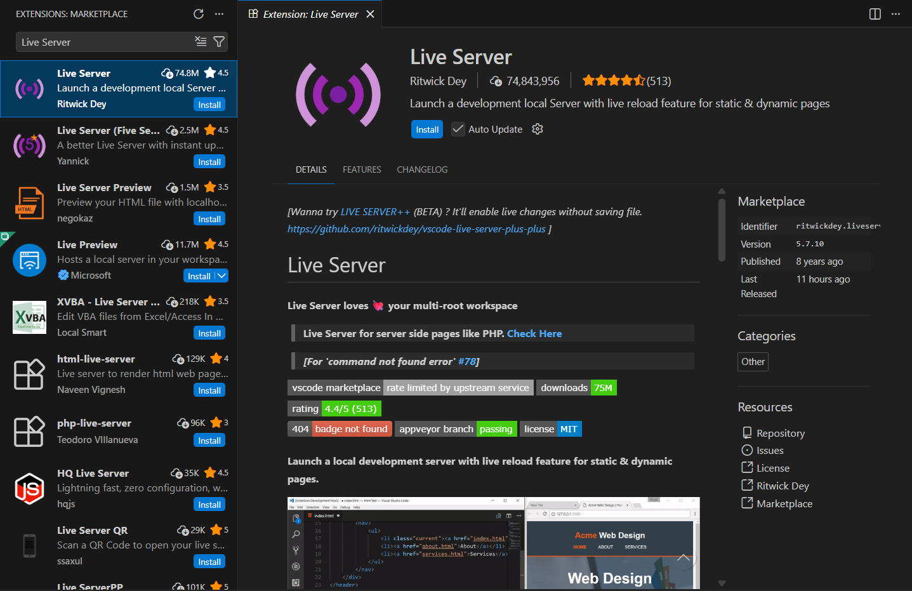
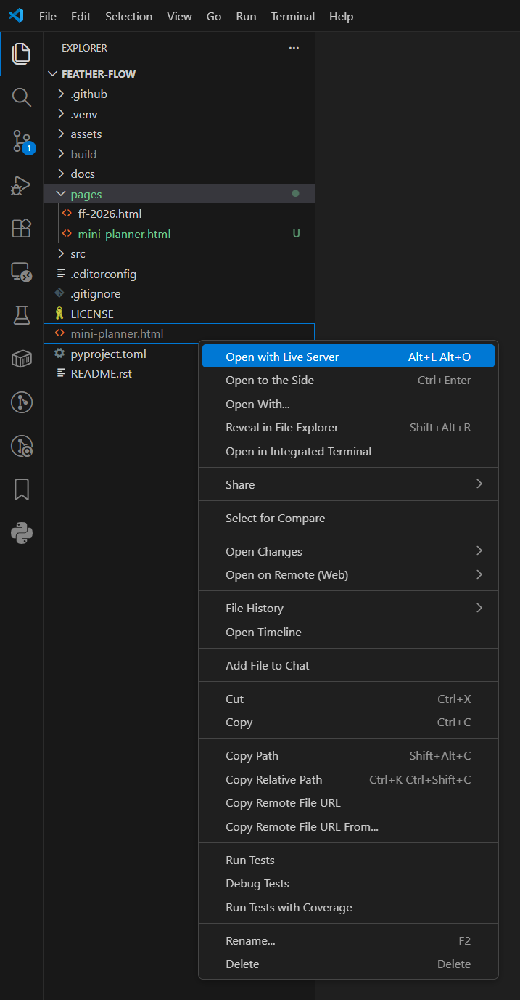
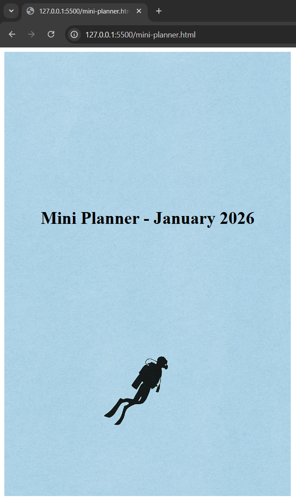

Live Preview with VS Code
=========================

Generating a PDF every time you change a color or move an element is slow. This
page shows a faster workflow: generate HTML once, open it with the VS Code Live
Server extension and let the browser refresh automatically each time you
regenerate.

**Key topics**

* Installing the Live Server extension for VS Code.
* Generating HTML output to the current directory.
* Opening the generated file with Live Server.
* The edit - regenerate - reload loop.
* Tips for keeping asset paths working.


Install Live Server
-------------------

1. Open VS Code.
2. Go to the Extensions panel (``Ctrl+Shift+X`` on Windows and Linux,
   ``Cmd+Shift+X`` on macOS).
3. Search for **Live Server** by Ritwick Dey.
4. Click **Install**.




Generate the HTML file
----------------------

From the repository root run::

    pyplaner --html pages/mini-planner.html

This creates ``mini-planner.html`` in the current working directory (the
repository root). The file contains the fully rendered HTML - no Jinja2 syntax
remains, just plain HTML that any browser can display.

.. tip::

   Use ``--html`` if you want only the HTML file and want to skip the slower PDF
   step entirely.


Open with Live Server
---------------------

1. Make sure you have opened the repository root folder in VS Code
   (**File > Open Folder** and select ``feather-flow/``). This is important
   because Live Server serves files relative to the workspace root, and your
   template references assets with paths like ``assets/mini-cover.png``.

2. In the VS Code Explorer panel find the generated ``mini-planner.html`` file
   (it is at the repository root, not inside ``pages/``).

3. Right-click the file and choose **Open with Live Server**.



Your default browser opens with the planner. Background images, fonts and
stylesheets should all load correctly because Live Server serves from the
workspace root where the ``assets/`` folder lives.




The edit - regenerate - reload loop
-----------------------------------

With Live Server running your workflow looks like this:

1. **Edit** the template in ``pages/mini-planner.html`` (change a color, add a
   div, adjust spacing).

2. **Regenerate** the HTML. Switch to the terminal and run::

       pyplaner --html pages/mini-planner.html

3. **View** - Live Server detects that ``mini-planner.html`` changed on disk and
   reloads the browser automatically.

.. tip::

   Keep a terminal open at the bottom of VS Code (``Ctrl+```). After running the
   command once you can press the Up arrow key and Enter to rerun it quickly.


Why not edit the generated file directly?
-----------------------------------------

The generated ``mini-planner.html`` is a *build artifact*. It is overwritten
every time you run pyplaner. Any changes you make to it will be lost on the next
regeneration. Always edit the source template in ``pages/``.

.. warning::

   Never edit the generated HTML file. Edit the template in ``pages/`` and
   regenerate.


Troubleshooting
---------------

Images or fonts are missing in the browser
~~~~~~~~~~~~~~~~~~~~~~~~~~~~~~~~~~~~~~~~~~

Make sure you opened the repository root as the VS Code workspace. If you opened
a subfolder (such as ``pages/``) the relative path ``assets/mini-cover.png``
will not resolve because ``assets/`` is not inside ``pages/``.

Live Server does not reload
~~~~~~~~~~~~~~~~~~~~~~~~~~~

Check that Live Server is still running (look for the port number in the VS Code
status bar, for example ``Port: 5500``). If it stopped, right-click the HTML
file and choose **Open with Live Server** again.

Also confirm that the output file is in the workspace root. pyplaner writes to
the current working directory, so if you ``cd pages`` before running the command
the HTML will end up inside ``pages/`` and Live Server may not detect the change
at the root level.

Browser shows Jinja2 syntax
~~~~~~~~~~~~~~~~~~~~~~~~~~~~

You are opening the template file (``pages/mini-planner.html``) instead of the
generated file (``mini-planner.html`` at the repository root). Open the
generated file instead.


Do and don't summary
--------------------

.. list-table::
   :header-rows: 1
   :widths: 50 50

   * - Do
     - Don't
   * - Open the repository root as the VS Code workspace.
     - Open a subfolder - asset paths will break.
   * - Open the generated file with Live Server.
     - Open the template file (it contains Jinja2 syntax the browser cannot
       understand).
   * - Edit the template in ``pages/``.
     - Edit the generated HTML (it is overwritten on every build).
   * - Use ``--html`` for faster iteration.
     - Generate PDF every time (much slower).
   * - Run pyplaner from the repository root.
     - ``cd`` into a subdirectory before running (output lands in the wrong
       place).


Summary
-------

You have completed the Designer Guide. Here is a recap of what you learned:

1. **Project structure** - templates in ``pages/``, assets in ``assets/``,
   output to the current directory.
2. **Template basics** - the ``.page`` div, ``planner_head``, background images.
3. **Jinja2 variables** - ``{{ }}``, ``%% set``, dot notation, filters,
   comments.
4. **Loops and conditionals** - ``for``/``endfor``, ``if``/``endif``,
   ``is none``, the ``loop`` variable.
5. **Macros** - reusable blocks with ``macro``/``endmacro``.
6. **Data reference** - ``calendar``, Year, Month, Day, WeekDay and all their
   properties.
7. **Assets** - path rules, CSS patterns, custom fonts.
8. **Live preview** - VS Code Live Server for fast iteration.

Try changing colors, fonts or layouts in the Mini Planner. When you are
comfortable, create your own template from scratch.

Happy designing!
