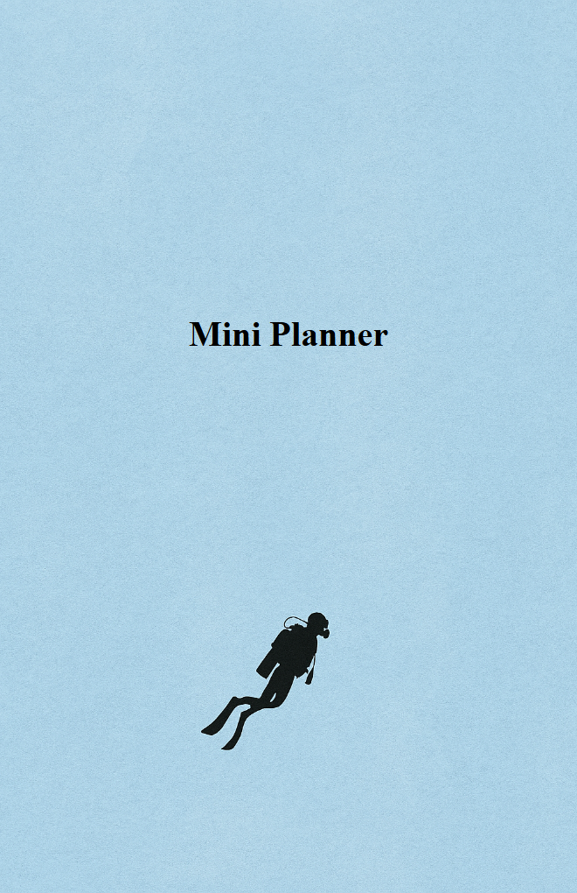

Template Basics
===============

This page shows the minimal HTML structure every Feather Flow template needs.
You will create the first file of the Mini Planner running example - a single
cover page with a background image and a title.

**Key topics**

* Minimal HTML boilerplate for a planner template.
* The ``planner_head`` variable and why it is required.
* The ``.page`` div pattern and page sizing.
* Adding a full-page background image.
* Generating the HTML output with pyplaner.


Minimal template
----------------

Create a new file ``pages/mini-planner.html`` with the following content. Our
Mini Planner uses half-letter paper (5.5 x 8.5 in):

.. code-block:: html+jinja

   <!doctype html>
   <html>
   <head>
     {{ planner_head }}
     <meta charset="utf-8">
     <style>
       @page { size: 139.7mm 215.9mm; margin: 0; }
       .page {
         position: relative;
         width: 139.7mm; height: 215.9mm;
         overflow: hidden;
         page-break-after: always;
         break-after: page;
       }
     </style>
   </head>
   <body>
     <div class="page">
       <h1 style="text-align: center; padding-top: 70mm;">
         Mini Planner
       </h1>
     </div>
   </body>
   </html>

There are a few things to notice here.


``planner_head``
~~~~~~~~~~~~~~~~

Every template receives a variable called ``planner_head``. You must put it
inside ``<head>``:

.. code-block:: html+jinja

   <head>
     {{ planner_head }}
     ...
   </head>

When you generate HTML this variable is an empty string, so it does nothing.
When you generate a PDF it contains a ``<base>`` tag that tells the browser
where to find your assets. If you forget it, images and fonts will be missing
from the PDF.

.. warning::

   Always include ``{{ planner_head }}`` inside ``<head>``. Without it PDF
   generation will fail to load assets.


The ``.page`` div
~~~~~~~~~~~~~~~~~

Every planner page lives inside a ``<div class="page">``. Look at the
``<style>`` block in the minimal template:

.. code-block:: css

   @page { size: 139.7mm 215.9mm; margin: 0; }
   .page {
     position: relative;
     width: 139.7mm; height: 215.9mm;
     overflow: hidden;
     page-break-after: always;
     break-after: page;
   }

The ``@page`` rule tells the PDF generator which paper size to use. The
``.page`` class sets the div to exactly the same dimensions so the browser
preview matches the printed page.

* ``page-break-after: always`` separates pages in the PDF - each ``.page`` div
  becomes one printed page.
* ``overflow: hidden`` crops anything that extends beyond the page edge.
* ``position: relative`` lets child elements position themselves inside the
  page.

.. tip::

   Common paper sizes: ``size: A4`` (210 x 297 mm), ``size: letter``
   (215.9 x 279.4 mm), ``size: A5`` (148 x 210 mm). For sizes without a keyword,
   specify width and height explicitly as shown above.


Adding a background
~~~~~~~~~~~~~~~~~~~

Background images are placed as ```` tags inside a ``.page`` div. To make
an image fill the entire page behind the content, add a CSS class. We will call
it ``.back``:

.. code-block:: css

   .back {
     position: absolute; inset: 0;
     width: 100%; height: 100%;
     object-fit: cover; z-index: -1;
   }

Add this rule to the ``<style>`` block and then use it inside a ``.page`` div:

.. code-block:: html+jinja

   <div class="page">
     
     <h1 style="text-align: center; padding-top: 70mm;">
       Mini Planner
     </h1>
   </div>

``position: absolute`` together with ``inset: 0`` stretches the image to the
edges of the parent ``.page`` div (which has ``position: relative``).
``z-index: -1`` pushes the image behind all other content. ``object-fit: cover``
scales the image to fill the page without distortion.


Linking a stylesheet
~~~~~~~~~~~~~~~~~~~~

When your ``<style>`` block grows large you can move the CSS into a
separate file in ``assets/`` and link it with a normal ``<link>``
tag. Paths are relative to the project root (the current working
directory where pyplaner writes the output):

.. code-block:: html+jinja

   <link rel="stylesheet" href="assets/mini-planner.css">

The generated HTML lands in the repository root. The ``assets/`` folder is a
direct child of the root, so the path is simply ``assets/<filename>``.

See :doc:`assets-and-styling` for the full explanation of path rules.


Generate and preview
--------------------

From the repository root run::

    pyplaner --html pages/mini-planner.html

A file called ``mini-planner.html`` appears in the current directory.
Open it in your browser.



If the background image shows and the title is visible you are ready to move on.

.. tip::

   Use ``--html`` during development. It is much faster than PDF generation
   because it skips the Chromium step. See :doc:`live-preview` for a workflow
   that reloads the browser automatically.


Do and don't
------------

.. list-table::
   :header-rows: 1
   :widths: 50 50

   * - Do
     - Don't
   * - Include ``{{ planner_head }}`` inside ``<head>``.
     - Leave it out - PDF will miss assets.
   * - Wrap every page in ``<div class="page">``.
     - Put multiple pages in one div.
   * - Move large CSS blocks into a separate file.
     - Keep hundreds of lines of CSS inline when a linked file would be cleaner.


Current state of the Mini Planner
---------------------------------

After this page your template looks like this:

.. code-block:: html+jinja

   <!doctype html>
   <html>
   <head>
     {{ planner_head }}
     <meta charset="utf-8">
     <style>
       @page { size: 139.7mm 215.9mm; margin: 0; }
       .page {
         position: relative;
         width: 139.7mm; height: 215.9mm;
         overflow: hidden;
         page-break-after: always;
         break-after: page;
       }
       .back {
         position: absolute; inset: 0;
         width: 100%; height: 100%;
         object-fit: cover; z-index: -1;
       }
     </style>
   </head>
   <body>
     <div class="page">
       
       <h1 style="text-align: center; padding-top: 70mm;">
         Mini Planner
       </h1>
     </div>
   </body>
   </html>

One page, one background, one title, half-letter paper. Next we add
dynamic content.


What is next
------------

Continue to :doc:`jinja2-variables` to learn how to use variables, expressions
and comments in your template.
